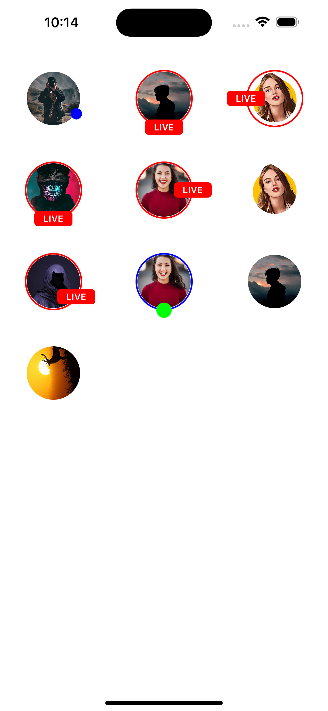

# LiveIndicatorOverlayKit
A lightweight and customizable Live Indicator for UIImageView in Swift. Easily add a LIVE overlay with dynamic positioning, border customization, and flexible UI options. Perfect for live-streaming apps, social media feeds, and real-time content indicators.

## Features
- Apply a **LIVE** label with customizable text, colors, and fonts
- Add dynamic borders with adjustable width and color
- Support for multiple positioning options (top-left, top-right, bottom-left, bottom-right, custom positions)
- Easy to integrate with `UIImageView` in collection views, table views, or standalone usage
- Includes an option to remove the overlay dynamically

## Demo
A sample implementation using a `UICollectionView` is included. Below is a preview:



## Installation
Simply drag and drop the `LiveOverlay` implementation into your project.

## Usage
### Applying a LIVE Overlay to an `UIImageView`
```swift
profileImageView.applyLiveOverlay(borderWidth: 2,
                                  borderColor: .red,
                                  borderCornerRadius: profileImageView.layer.cornerRadius,
                                  liveCornerRadius: 5,
                                  liveText: "LIVE",
                                  liveTextColor: .white,
                                  liveBackgroundColor: .red,
                                  font: .boldSystemFont(ofSize: 12),
                                  labelHeight: 20,
                                  labelWidth: 50,
                                  padding: 5,
                                  liveLabelPosition: .bottom)
```

### Removing the Overlay
```swift
profileImageView.removeLiveOverlay()
```

## Example Implementation in a Collection View
Below is an example of how you can use `LiveOverlay` in a `UICollectionViewCell`:

```swift
class ProfileCell: UICollectionViewCell {
    static let identifier = "ProfileCell"
    
    let profileImageView = UIImageView()
    
    override init(frame: CGRect) {
        super.init(frame: frame)
        setupProfileImageView()
    }
    
    required init?(coder: NSCoder) {
        fatalError("init(coder:) has not been implemented")
    }
    
    private func setupProfileImageView() {
        contentView.addSubview(profileImageView)
        profileImageView.translatesAutoresizingMaskIntoConstraints = false
        NSLayoutConstraint.activate([
            profileImageView.topAnchor.constraint(equalTo: contentView.topAnchor, constant: 15),
            profileImageView.leadingAnchor.constraint(equalTo: contentView.leadingAnchor, constant: 15),
            profileImageView.trailingAnchor.constraint(equalTo: contentView.trailingAnchor, constant: -15),
            profileImageView.bottomAnchor.constraint(equalTo: contentView.bottomAnchor, constant: -15)
        ])
        profileImageView.contentMode = .scaleAspectFill
        profileImageView.layer.cornerRadius = 35
        profileImageView.clipsToBounds = true
    }
    
    func applyOverlay(index: Int) {
        switch index {
        case 0:
            profileImageView.applyLiveOverlay(liveCornerRadius: 8,
                                              liveText: "",
                                              liveBackgroundColor: .blue,
                                              labelHeight: 15,
                                              labelWidth: 15,
                                              padding: 5,
                                              liveLabelPosition: .custom(x: 30, y: 20))
        case 5:
            profileImageView.removeLiveOverlay()
        default:
            break
        }
    }
}
```

## License
This project is open-source and available under the [MIT License](LICENSE).

## Contributing
Feel free to open issues or submit pull requests to improve this library!

---

✨ Enjoy using **LiveOverlay** to enhance your iOS app! 🚀


